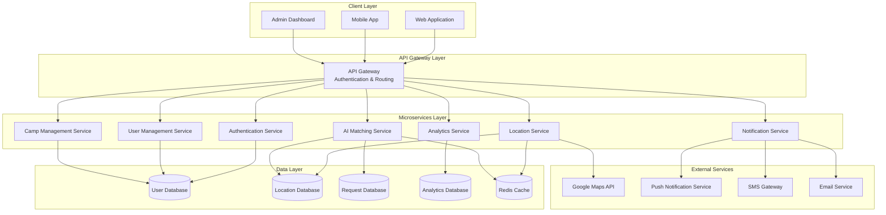
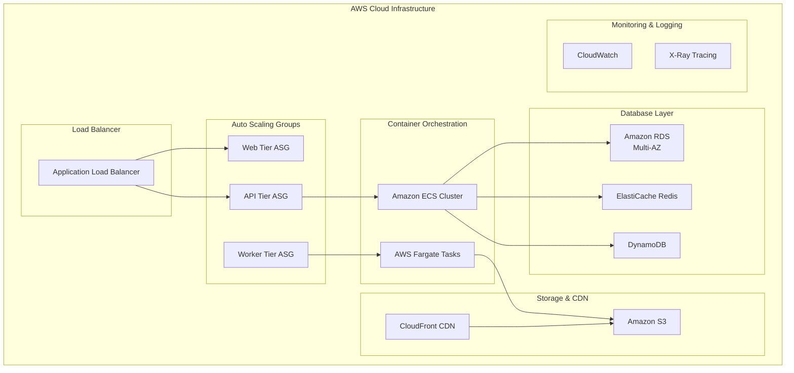
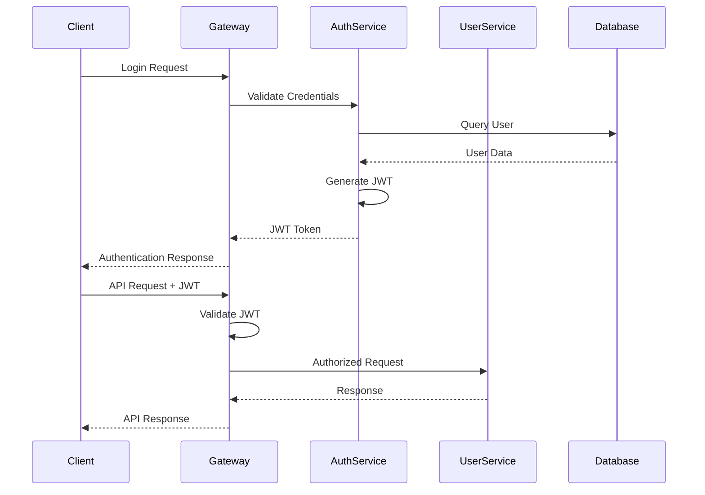

# Design Document

## Overview

BloodSync Life is designed as a cloud-native, microservices-based platform that leverages AI and GPS technologies to create an intelligent blood donation network. The system architecture prioritizes real-time responsiveness, scalability, and reliability to handle emergency blood requests efficiently.

The platform employs a distributed architecture with separate services for user management, location tracking, AI-powered matching, notifications, and analytics. This design ensures high availability and allows independent scaling of components based on demand patterns.

## Architecture

### High-Level Architecture



### Deployment Architecture



## Components and Interfaces

### Authentication Service

**Responsibilities:**
- JWT token generation and validation
- User authentication and authorization
- Role-based access control (RBAC)
- Session management

**Key Interfaces:**
```typescript
interface AuthenticationService {
  authenticate(credentials: LoginCredentials): Promise<AuthToken>
  validateToken(token: string): Promise<UserSession>
  refreshToken(refreshToken: string): Promise<AuthToken>
  revokeToken(token: string): Promise<void>
}

interface LoginCredentials {
  email: string
  password: string
  userType: 'donor' | 'requester' | 'admin'
}

interface AuthToken {
  accessToken: string
  refreshToken: string
  expiresIn: number
  userRole: string
}
```

### User Management Service

**Responsibilities:**
- User registration and profile management
- Donor eligibility validation
- Medical history tracking
- Privacy settings management

**Key Interfaces:**
```typescript
interface UserManagementService {
  registerUser(userData: UserRegistration): Promise<User>
  updateProfile(userId: string, updates: ProfileUpdate): Promise<User>
  getDonorProfile(donorId: string): Promise<DonorProfile>
  validateDonorEligibility(donorId: string): Promise<EligibilityStatus>
}

interface DonorProfile extends User {
  bloodType: BloodType
  lastDonationDate: Date
  medicalEligibility: boolean
  donationHistory: DonationRecord[]
  availabilityStatus: 'available' | 'unavailable' | 'recently_donated'
}
```

### Location Service

**Responsibilities:**
- Real-time GPS coordinate tracking
- Location history management
- Geospatial queries and proximity calculations
- Privacy-compliant location sharing

**Key Interfaces:**
```typescript
interface LocationService {
  updateLocation(userId: string, coordinates: GeoCoordinates): Promise<void>
  getNearbyDonors(center: GeoCoordinates, radius: number, bloodType: BloodType): Promise<DonorLocation[]>
  getLocationHistory(userId: string, timeRange: TimeRange): Promise<LocationHistory[]>
  enableLocationSharing(userId: string, settings: LocationSettings): Promise<void>
}

interface GeoCoordinates {
  latitude: number
  longitude: number
  accuracy: number
  timestamp: Date
}

interface DonorLocation {
  donorId: string
  coordinates: GeoCoordinates
  distance: number
  bloodType: BloodType
  availabilityStatus: string
}
```

### AI Matching Service

**Responsibilities:**
- Intelligent donor-request matching
- Multi-criteria optimization (distance, availability, response history)
- Emergency prioritization algorithms
- Predictive analytics for donor availability

**Key Interfaces:**
```typescript
interface AIMatchingService {
  findOptimalDonors(request: BloodRequest): Promise<MatchResult[]>
  rankDonorsByPriority(donors: DonorProfile[], request: BloodRequest): Promise<RankedDonor[]>
  predictDonorResponse(donorId: string, requestContext: RequestContext): Promise<ResponsePrediction>
  optimizeMatchingAlgorithm(historicalData: MatchingData[]): Promise<void>
}

interface BloodRequest {
  requestId: string
  bloodType: BloodType
  urgencyLevel: 'low' | 'medium' | 'high' | 'critical'
  location: GeoCoordinates
  requiredUnits: number
  requesterId: string
  medicalFacility?: string
}

interface MatchResult {
  donorId: string
  matchScore: number
  estimatedResponseTime: number
  distance: number
  confidenceLevel: number
}
```

### Notification Service

**Responsibilities:**
- Multi-channel notification delivery (push, SMS, email)
- Emergency alert prioritization
- Notification preferences management
- Delivery confirmation tracking

**Key Interfaces:**
```typescript
interface NotificationService {
  sendEmergencyAlert(alert: EmergencyAlert): Promise<NotificationResult>
  sendReminder(reminder: ReminderNotification): Promise<NotificationResult>
  updateNotificationPreferences(userId: string, preferences: NotificationPreferences): Promise<void>
  getDeliveryStatus(notificationId: string): Promise<DeliveryStatus>
}

interface EmergencyAlert {
  recipientId: string
  requestId: string
  message: string
  urgencyLevel: string
  location: GeoCoordinates
  expirationTime: Date
}
```

## Data Models

### Core Entity Models

```typescript
// User and Authentication Models
interface User {
  userId: string
  email: string
  phoneNumber: string
  firstName: string
  lastName: string
  dateOfBirth: Date
  userType: 'donor' | 'requester' | 'admin'
  registrationDate: Date
  isActive: boolean
  privacySettings: PrivacySettings
}

interface DonorProfile extends User {
  bloodType: BloodType
  weight: number
  medicalConditions: string[]
  lastDonationDate?: Date
  totalDonations: number
  eligibilityStatus: EligibilityStatus
  emergencyContact: ContactInfo
  preferredDonationCenters: string[]
}

// Request and Matching Models
interface BloodRequest {
  requestId: string
  requesterId: string
  bloodType: BloodType
  urgencyLevel: UrgencyLevel
  requiredUnits: number
  location: GeoCoordinates
  hospitalName?: string
  patientInfo: PatientInfo
  requestTime: Date
  expirationTime: Date
  status: RequestStatus
  assignedDonors: string[]
}

interface DonationRecord {
  donationId: string
  donorId: string
  requestId?: string
  donationDate: Date
  location: GeoCoordinates
  bloodType: BloodType
  unitsCollected: number
  donationType: 'emergency' | 'scheduled' | 'camp'
  medicalClearance: boolean
  notes?: string
}

// Location and Tracking Models
interface LocationUpdate {
  userId: string
  coordinates: GeoCoordinates
  timestamp: Date
  accuracy: number
  source: 'gps' | 'network' | 'manual'
}

interface BloodCamp {
  campId: string
  organizerId: string
  name: string
  description: string
  location: GeoCoordinates
  address: string
  startTime: Date
  endTime: Date
  expectedDonors: number
  registeredDonors: string[]
  status: 'planned' | 'active' | 'completed' | 'cancelled'
}
```

### Database Schema Design

```sql
-- Users and Authentication
CREATE TABLE users (
    user_id UUID PRIMARY KEY,
    email VARCHAR(255) UNIQUE NOT NULL,
    password_hash VARCHAR(255) NOT NULL,
    phone_number VARCHAR(20),
    first_name VARCHAR(100) NOT NULL,
    last_name VARCHAR(100) NOT NULL,
    date_of_birth DATE,
    user_type ENUM('donor', 'requester', 'admin') NOT NULL,
    registration_date TIMESTAMP DEFAULT CURRENT_TIMESTAMP,
    is_active BOOLEAN DEFAULT TRUE,
    created_at TIMESTAMP DEFAULT CURRENT_TIMESTAMP,
    updated_at TIMESTAMP DEFAULT CURRENT_TIMESTAMP ON UPDATE CURRENT_TIMESTAMP
);

-- Donor-specific information
CREATE TABLE donor_profiles (
    donor_id UUID PRIMARY KEY REFERENCES users(user_id),
    blood_type ENUM('A+', 'A-', 'B+', 'B-', 'AB+', 'AB-', 'O+', 'O-') NOT NULL,
    weight DECIMAL(5,2),
    last_donation_date DATE,
    total_donations INT DEFAULT 0,
    eligibility_status ENUM('eligible', 'ineligible', 'pending') DEFAULT 'pending',
    medical_conditions TEXT,
    emergency_contact_name VARCHAR(100),
    emergency_contact_phone VARCHAR(20),
    availability_status ENUM('available', 'unavailable', 'recently_donated') DEFAULT 'available',
    created_at TIMESTAMP DEFAULT CURRENT_TIMESTAMP,
    updated_at TIMESTAMP DEFAULT CURRENT_TIMESTAMP ON UPDATE CURRENT_TIMESTAMP
);

-- Blood requests
CREATE TABLE blood_requests (
    request_id UUID PRIMARY KEY,
    requester_id UUID REFERENCES users(user_id),
    blood_type ENUM('A+', 'A-', 'B+', 'B-', 'AB+', 'AB-', 'O+', 'O-') NOT NULL,
    urgency_level ENUM('low', 'medium', 'high', 'critical') NOT NULL,
    required_units INT NOT NULL,
    latitude DECIMAL(10, 8) NOT NULL,
    longitude DECIMAL(11, 8) NOT NULL,
    hospital_name VARCHAR(255),
    patient_name VARCHAR(100),
    patient_age INT,
    request_time TIMESTAMP DEFAULT CURRENT_TIMESTAMP,
    expiration_time TIMESTAMP,
    status ENUM('pending', 'matched', 'fulfilled', 'expired', 'cancelled') DEFAULT 'pending',
    created_at TIMESTAMP DEFAULT CURRENT_TIMESTAMP,
    updated_at TIMESTAMP DEFAULT CURRENT_TIMESTAMP ON UPDATE CURRENT_TIMESTAMP
);

-- Location tracking
CREATE TABLE location_updates (
    location_id UUID PRIMARY KEY,
    user_id UUID REFERENCES users(user_id),
    latitude DECIMAL(10, 8) NOT NULL,
    longitude DECIMAL(11, 8) NOT NULL,
    accuracy DECIMAL(8, 2),
    timestamp TIMESTAMP NOT NULL,
    source ENUM('gps', 'network', 'manual') DEFAULT 'gps',
    created_at TIMESTAMP DEFAULT CURRENT_TIMESTAMP
);

-- Donation records
CREATE TABLE donation_records (
    donation_id UUID PRIMARY KEY,
    donor_id UUID REFERENCES donor_profiles(donor_id),
    request_id UUID REFERENCES blood_requests(request_id),
    donation_date TIMESTAMP NOT NULL,
    latitude DECIMAL(10, 8),
    longitude DECIMAL(11, 8),
    blood_type ENUM('A+', 'A-', 'B+', 'B-', 'AB+', 'AB-', 'O+', 'O-') NOT NULL,
    units_collected DECIMAL(4, 2) NOT NULL,
    donation_type ENUM('emergency', 'scheduled', 'camp') NOT NULL,
    medical_clearance BOOLEAN DEFAULT FALSE,
    notes TEXT,
    created_at TIMESTAMP DEFAULT CURRENT_TIMESTAMP
);

-- Blood camps
CREATE TABLE blood_camps (
    camp_id UUID PRIMARY KEY,
    organizer_id UUID REFERENCES users(user_id),
    name VARCHAR(255) NOT NULL,
    description TEXT,
    latitude DECIMAL(10, 8) NOT NULL,
    longitude DECIMAL(11, 8) NOT NULL,
    address TEXT NOT NULL,
    start_time TIMESTAMP NOT NULL,
    end_time TIMESTAMP NOT NULL,
    expected_donors INT DEFAULT 0,
    status ENUM('planned', 'active', 'completed', 'cancelled') DEFAULT 'planned',
    created_at TIMESTAMP DEFAULT CURRENT_TIMESTAMP,
    updated_at TIMESTAMP DEFAULT CURRENT_TIMESTAMP ON UPDATE CURRENT_TIMESTAMP
);

-- Indexes for performance
CREATE INDEX idx_donor_blood_type ON donor_profiles(blood_type);
CREATE INDEX idx_donor_availability ON donor_profiles(availability_status);
CREATE INDEX idx_request_status ON blood_requests(status);
CREATE INDEX idx_request_urgency ON blood_requests(urgency_level);
CREATE INDEX idx_location_user_time ON location_updates(user_id, timestamp);
CREATE SPATIAL INDEX idx_location_coordinates ON location_updates(latitude, longitude);
CREATE SPATIAL INDEX idx_request_coordinates ON blood_requests(latitude, longitude);
```
## AI Matching Algorithm Design

### Multi-Criteria Optimization Algorithm

The AI matching system employs a weighted scoring algorithm that considers multiple factors:

```typescript
interface MatchingCriteria {
  distance: number        // Weight: 0.35
  availability: number    // Weight: 0.25
  responseHistory: number // Weight: 0.20
  bloodCompatibility: number // Weight: 0.15
  urgencyBonus: number   // Weight: 0.05
}

class AIMatchingAlgorithm {
  calculateMatchScore(donor: DonorProfile, request: BloodRequest): number {
    const distanceScore = this.calculateDistanceScore(donor.location, request.location)
    const availabilityScore = this.calculateAvailabilityScore(donor)
    const historyScore = this.calculateResponseHistoryScore(donor.donorId)
    const compatibilityScore = this.calculateBloodCompatibilityScore(donor.bloodType, request.bloodType)
    const urgencyBonus = this.calculateUrgencyBonus(request.urgencyLevel)
    
    return (
      distanceScore * 0.35 +
      availabilityScore * 0.25 +
      historyScore * 0.20 +
      compatibilityScore * 0.15 +
      urgencyBonus * 0.05
    )
  }
}
```

### Real-Time Location Processing

The system uses a combination of GPS tracking and geospatial indexing for efficient location-based matching:

```typescript
interface LocationProcessor {
  updateDonorLocation(donorId: string, coordinates: GeoCoordinates): Promise<void>
  findNearbyDonors(center: GeoCoordinates, radius: number): Promise<DonorLocation[]>
  calculateOptimalRadius(urgencyLevel: string, availableDonors: number): number
}

class GeospatialService {
  // Uses R-tree spatial indexing for O(log n) proximity queries
  private spatialIndex: RTree<DonorLocation>
  
  async findDonorsInRadius(center: GeoCoordinates, radiusKm: number): Promise<DonorLocation[]> {
    const boundingBox = this.calculateBoundingBox(center, radiusKm)
    return this.spatialIndex.search(boundingBox)
      .filter(donor => this.calculateDistance(center, donor.coordinates) <= radiusKm)
      .sort((a, b) => a.distance - b.distance)
  }
}
```

## Security Design

### Authentication and Authorization



### Data Protection Measures

**Encryption Standards:**
- AES-256 encryption for data at rest
- TLS 1.3 for data in transit
- Field-level encryption for sensitive medical data
- Key rotation every 90 days

**Privacy Controls:**
- Granular location sharing permissions
- Automatic data anonymization after 2 years
- GDPR-compliant data deletion
- Audit logging for all data access

### Role-Based Access Control (RBAC)

```typescript
enum UserRole {
  DONOR = 'donor',
  REQUESTER = 'requester',
  HOSPITAL_ADMIN = 'hospital_admin',
  SYSTEM_ADMIN = 'system_admin',
  CAMP_ORGANIZER = 'camp_organizer'
}

interface Permission {
  resource: string
  action: 'create' | 'read' | 'update' | 'delete'
  conditions?: Record<string, any>
}

const rolePermissions: Record<UserRole, Permission[]> = {
  [UserRole.DONOR]: [
    { resource: 'profile', action: 'read' },
    { resource: 'profile', action: 'update', conditions: { ownProfile: true } },
    { resource: 'donations', action: 'read', conditions: { ownRecords: true } },
    { resource: 'requests', action: 'read', conditions: { assignedToDonor: true } }
  ],
  [UserRole.REQUESTER]: [
    { resource: 'requests', action: 'create' },
    { resource: 'requests', action: 'read', conditions: { ownRequests: true } },
    { resource: 'donors', action: 'read', conditions: { matchedDonors: true } }
  ],
  [UserRole.SYSTEM_ADMIN]: [
    { resource: '*', action: 'create' },
    { resource: '*', action: 'read' },
    { resource: '*', action: 'update' },
    { resource: '*', action: 'delete' }
  ]
}
```

## Error Handling

### Error Classification and Response Strategy

```typescript
enum ErrorType {
  VALIDATION_ERROR = 'VALIDATION_ERROR',
  AUTHENTICATION_ERROR = 'AUTHENTICATION_ERROR',
  AUTHORIZATION_ERROR = 'AUTHORIZATION_ERROR',
  RESOURCE_NOT_FOUND = 'RESOURCE_NOT_FOUND',
  EXTERNAL_SERVICE_ERROR = 'EXTERNAL_SERVICE_ERROR',
  SYSTEM_ERROR = 'SYSTEM_ERROR'
}

interface ErrorResponse {
  errorType: ErrorType
  message: string
  details?: Record<string, any>
  timestamp: Date
  requestId: string
  retryable: boolean
}

class ErrorHandler {
  handleError(error: Error, context: RequestContext): ErrorResponse {
    const errorResponse: ErrorResponse = {
      errorType: this.classifyError(error),
      message: this.sanitizeErrorMessage(error.message),
      timestamp: new Date(),
      requestId: context.requestId,
      retryable: this.isRetryable(error)
    }
    
    // Log error for monitoring
    this.logError(error, context)
    
    // Send alerts for critical errors
    if (this.isCritical(error)) {
      this.sendAlert(error, context)
    }
    
    return errorResponse
  }
}
```

### Circuit Breaker Pattern for External Services

```typescript
class CircuitBreaker {
  private failureCount = 0
  private lastFailureTime?: Date
  private state: 'CLOSED' | 'OPEN' | 'HALF_OPEN' = 'CLOSED'
  
  async execute<T>(operation: () => Promise<T>): Promise<T> {
    if (this.state === 'OPEN') {
      if (this.shouldAttemptReset()) {
        this.state = 'HALF_OPEN'
      } else {
        throw new Error('Circuit breaker is OPEN')
      }
    }
    
    try {
      const result = await operation()
      this.onSuccess()
      return result
    } catch (error) {
      this.onFailure()
      throw error
    }
  }
}
```

Now I need to use the prework tool to analyze the acceptance criteria before writing the Correctness Properties section:

<function_calls>
<invoke name="prework">
<parameter name="featureName">bloodsync-life
## Correctness Properties

*A property is a characteristic or behavior that should hold true across all valid executions of a system—essentially, a formal statement about what the system should do. Properties serve as the bridge between human-readable specifications and machine-verifiable correctness guarantees.*

Based on the prework analysis of acceptance criteria, the following properties have been identified for property-based testing. These properties ensure the system behaves correctly across all possible inputs and scenarios.

### Property 1: User Registration and Authentication Security
*For any* valid user registration data, creating an account should result in encrypted credential storage, and subsequent authentication with those credentials should grant appropriate access while invalid credentials are always rejected.
**Validates: Requirements 1.1, 1.2, 1.3, 1.5**

### Property 2: JWT Authentication Enforcement  
*For any* API endpoint and request, access should be granted only when a valid JWT token is provided, and all requests without valid tokens should be rejected.
**Validates: Requirements 1.4, 10.2**

### Property 3: Donor Profile Management Consistency
*For any* donor profile update with valid data, the changes should be immediately stored and reflected in all subsequent queries, and availability status should correctly affect matching algorithm inclusion.
**Validates: Requirements 2.1, 2.3, 2.4, 2.5**

### Property 4: Real-Time Location Tracking Accuracy
*For any* donor with location sharing enabled, GPS coordinates should be updated at regular intervals and immediately upon significant movement, with proximity calculations always using the most recent coordinates.
**Validates: Requirements 2.2, 6.1, 6.2, 6.3**

### Property 5: Blood Request Processing Completeness
*For any* valid blood request submission, a Blood_Request record should be created immediately and trigger the matching algorithm to identify eligible donors within the specified parameters.
**Validates: Requirements 3.1, 3.2**

### Property 6: Blood Type Compatibility Validation
*For any* donor-request pairing, matches should only be created when blood types are medically compatible according to standard compatibility rules.
**Validates: Requirements 3.4**

### Property 7: AI Matching Algorithm Optimization
*For any* blood request, the AI matcher should rank donors by the specified criteria (proximity, availability, compatibility, response history) and prioritize emergency requests and fast responders appropriately.
**Validates: Requirements 3.3, 4.1, 4.2, 4.4, 4.5**

### Property 8: Medical Safety Interval Enforcement
*For any* donor with a recent donation date, they should be excluded from matching algorithms until the medically safe interval has passed.
**Validates: Requirements 4.3**

### Property 9: Emergency Notification Timeliness
*For any* successful donor-request match, an emergency alert should be sent to the donor within 30 seconds containing all required request details and location information.
**Validates: Requirements 5.1, 5.2**

### Property 10: Notification Flow Completeness
*For any* donor response (accept/decline), the appropriate notifications should be sent to requesters, and declined requests should automatically trigger selection of the next best donor.
**Validates: Requirements 5.3, 5.4**

### Property 11: Location Privacy Enforcement
*For any* user location data, sharing should respect privacy settings, and fallback to last known location should include appropriate warnings when GPS is unavailable.
**Validates: Requirements 6.4, 6.5**

### Property 12: Multi-Request Independence
*For any* hospital submitting multiple blood requests, each request should be managed as a separate transaction without interference between requests.
**Validates: Requirements 7.1**

### Property 13: Real-Time Data Synchronization
*For any* data update (inventory, donation completion, request status), changes should be immediately reflected in all relevant dashboards and records across the system.
**Validates: Requirements 7.2, 7.3, 7.4**

### Property 14: Blood Camp Management Workflow
*For any* blood camp creation, multiple donors should be able to register, appropriate notifications should be sent, and completion should update all participant donation records.
**Validates: Requirements 8.1, 8.2, 8.3, 8.5**

### Property 15: Administrative Dashboard Accuracy
*For any* admin dashboard access, displayed metrics should reflect the current system state, and reports should contain accurate calculated data on donations, response times, and engagement.
**Validates: Requirements 9.1, 9.3**

### Property 16: Security Monitoring and Response
*For any* suspicious activity detection or data breach, appropriate alerts should be sent to administrators, security events should be logged, and affected accounts should be secured.
**Validates: Requirements 9.2, 10.5**

### Property 17: Data Encryption and Privacy Compliance
*For any* user data storage, personal and medical information should be encrypted, and data deletion requests should remove personal data while preserving anonymized statistics.
**Validates: Requirements 10.1, 10.3**

### Property 18: Role-Based Access Control
*For any* user attempting to access resources, access should be granted only for resources appropriate to their assigned role.
**Validates: Requirements 10.4**

### Property 19: Cross-Platform Interface Consistency
*For any* core feature, functionality should work identically across web and mobile interfaces, with responsive design adapting appropriately to different screen sizes.
**Validates: Requirements 11.1, 11.4**

### Property 20: Graceful Degradation Under Constraints
*For any* network connectivity issues or accessibility needs, the system should maintain essential functionality in low-bandwidth mode and support assistive technologies.
**Validates: Requirements 11.2, 11.3**

### Property 21: Offline Data Synchronization
*For any* offline usage period, critical information should be cached and properly synchronized when connectivity is restored.
**Validates: Requirements 11.5**

### Property 22: Performance and Scalability Maintenance
*For any* increase in user load or matching requests, the system should maintain response times under specified limits through automatic scaling and meet performance targets for concurrent users.
**Validates: Requirements 12.1, 12.2, 12.4**

### Property 23: Automatic Resource Scaling
*For any* approach to database capacity limits, storage should expand automatically before limits are reached.
**Validates: Requirements 12.3**

### Property 24: High Availability Through Redundancy
*For any* system component failure, service availability should be maintained through redundancy and failover mechanisms.
**Validates: Requirements 12.5**

## Testing Strategy

### Dual Testing Approach

BloodSync Life employs a comprehensive testing strategy that combines unit testing and property-based testing to ensure both specific correctness and universal behavior validation.

**Unit Testing Focus:**
- Specific examples of blood type compatibility rules
- Edge cases in location calculations and GPS accuracy
- Error conditions in authentication and authorization
- Integration points between microservices
- Medical safety interval calculations
- Emergency alert formatting and content validation

**Property-Based Testing Focus:**
- Universal properties across all inputs using fast-check library for JavaScript/TypeScript
- Minimum 100 iterations per property test for comprehensive coverage
- Each property test tagged with: **Feature: bloodsync-life, Property {number}: {property_text}**
- Randomized test data generation for users, locations, blood requests, and system states
- Comprehensive input space exploration for matching algorithms and notification systems

**Property-Based Testing Configuration:**
```typescript
// Example property test configuration
import fc from 'fast-check'

describe('BloodSync Life Properties', () => {
  it('Property 1: User Registration and Authentication Security', () => {
    fc.assert(fc.property(
      fc.record({
        email: fc.emailAddress(),
        password: fc.string({ minLength: 8 }),
        bloodType: fc.constantFrom('A+', 'A-', 'B+', 'B-', 'AB+', 'AB-', 'O+', 'O-'),
        userType: fc.constantFrom('donor', 'requester')
      }),
      async (userData) => {
        const account = await authService.register(userData)
        expect(account.credentials).toBeEncrypted()
        
        const authResult = await authService.authenticate({
          email: userData.email,
          password: userData.password
        })
        expect(authResult.success).toBe(true)
        expect(authResult.userRole).toBe(userData.userType)
      }
    ), { numRuns: 100 })
  })
})
```

**Testing Infrastructure:**
- Automated test execution in CI/CD pipeline
- Test data factories for generating realistic medical and geographic data
- Mock external services (Google Maps, notification providers)
- Performance testing under simulated emergency load conditions
- Security testing with penetration testing tools
- Accessibility testing with automated screen reader simulation

**Coverage Requirements:**
- Minimum 90% code coverage for unit tests
- 100% property coverage for all identified correctness properties
- Integration test coverage for all microservice interactions
- End-to-end test coverage for critical user journeys (emergency blood request flow)
- Performance test coverage for all scalability requirements

The combination of unit and property-based testing ensures that BloodSync Life maintains correctness at both the specific example level and the universal behavior level, providing confidence in the system's reliability during critical emergency situations.